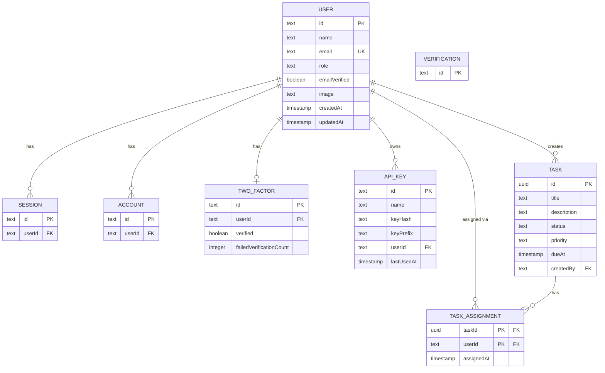

_This project has been created as part of the 42 curriculum by takitaga, ssoeno, genomoto, and tamatsuu._

# ft_transcendence
---

## Description

This project (LunaPhase; Derived from the phases of the moon) is a task management web app built with React and Hono. It combines authentication, permissions management, a public API, and a data visualization dashboard to help teams manage their tasks efficiently.

---

## Team Information

| Login    | Role                        | Responsibilities                               |
| -------- | --------------------------- | ---------------------------------------------- |
| takitaga | Product Owner + Developer   | Backlog management, design system, ELK stack   |
| ssoeno   | Project Manager + Developer | Public API and analytics implementation        |
| genomoto | Technical Lead + Developer  | Architecture design and code quality oversight |
| tamatsuu | Developer                   | ModSecurity implementation                     |

---

## Project Management

**Task organization:** We used [GitHub Projects](https://github.com/users/yuzu-juice/projects/3/views/2) to manage tasks, track progress, and distribute work among team members.

**Meeting cadence:**

We checked project progress approximately once a week.

**Communication:**
Discord for daily communication

---

## Instructions

### Prerequisites

- [Docker](https://www.docker.com/) and Docker Compose
- [OpenSSL](https://www.openssl.org/) for HTTPS support

### Setup

1. Clone the repository:

```bash
git clone <URL of the assignment repository>
cd <cloned repository directory>
```

2. Create a GitHub OAuth App:

This app implements OAuth authentication using a GitHub account.
Please visit the page to [create a GitHub OAuth App](https://github.com/settings/applications/new) and enter the information as follows.

- Application name : A name you like
- Homepage URL : `https://localhost:4443`
- Authorization callback URL : `https://localhost:4443/api/auth/callback/github`

Please save the ID and Secret that you receive after creation.

3. Copy the environment variables file and fill in the values:

Please configure the environment variables in `.env.prod` by referring to `.env.example`. However, some variables are subject to the following constraints:
For production deployment, create `.env.prod`.

- `DATABASE_URL` : `postgresql://<POSTGRES_USER>:<POSTGRES_PASSWORD>@database:5432/<POSTGRES_DB>`
- `BETTER_AUTH_URL` / `BASE_URL` : `https://localhost:4443`
- `BETTER_AUTH_SECRET` : The value generated by `openssl rand -base64 32`
- `INITIAL_ADMIN_PASSWORD` : A character string of 8 to 128 characters.
- `GITHUB_CLIENT_ID` : The ID created in Step 2.
- `GITHUB_CLIENT_SECRET` : The secret created in Step 2.
- `ELASTIC_PASSWORD` / `KIBANA_PASSWORD` : A string of 6 or more characters.
- `GF_DISCORD_WEBHOOK_URL` : Discord webhook URL
	- Please visit [Intro to Webhooks ](https://support.discord.com/hc/en-us/articles/228383668-Intro-to-Webhooks) to learn how to create a Discord webhook URL.
- `LOG_LEVEL` : The log level output by the backend. Must be one of: trace, debug, info, warn, error, or fatal. (The default value is set to "info".)
- `MODSEC_RULE_ENGINE` : You can specify values such as `DetectionOnly`, `On`, or `Off`.

4. Start the application (single command):

```bash
./start.sh
```

The application and supporting services are available through the reverse proxy at:

- Production: `https://localhost:4443`

The following paths provide access to the respective services:

- Storybook: `/storybook`
- Kibana: `/kibana`
	- The login name for Kibana is `elastic`, and the password is the `ELASTIC_PASSWORD` set in the environment variable.
- Grafana: `/grafana`
	- The login name and password for the initial access are the `GF_SECURITY_ADMIN_USER` and `GF_SECURITY_ADMIN_PASSWORD` values set in the environment variables.
- API Documentation (Swagger UI): `/api/v1/docs`

---

## Technical Stack

### Frontend

| Technology      | Version | Reason                                                                                                     |
| --------------- | ------- | ---------------------------------------------------------------------------------------------------------- |
| React           | 19.2.8  | Component-based UI; treated as a framework in this project due to its ecosystem and architectural patterns |
| Vite            | 8.2.0   | Fast build tool for modern frontend development                                                            |
| Tailwind CSS    | v4      | Utility-first CSS framework for rapid UI development, responsive UI development                            |
| TanStack Router | v1      | Type-safe file-based routing with built-in devtools and performance optimization                           |
| TanStack Query  | v5      | Simplifies data fetching and caching; prevents unnecessary re-fetches compared to plain useEffect/useState |
| TanStack Form   | latest  | Form implementation with type-safe validation                                                              |
| TanStack Charts | latest  | Chart rendering for analytics and data visualization                                                       |
| Zod             | 4.4.3   | Validates and parses form input values and URL parameters                                                   |
| Fontsource      | 5.3.0   | Provides the LINE Seed JP and Zen Maru Gothic fonts used by otsukimi-ui                                    |
| Hono            | 4.13.2  | Communicates with the backend through Hono RPC                                                             |
| react-i18next   | latest  | React integration of i18next for multi-language support                                                    |
| Sonner          | 2.0.8   | Toast notifications for API key issuance/revocation and user feedback                                      |
| react-csv       | 2.2.2   | CSV export for analytics and report-like downloads                                                         |
| react-qr-code   | 2.2.0   | QR code rendering for TOTP 2FA setup                                                                       |
| boring-avatars  | 2.0.4   | Deterministic fallback avatar generation                                                                   |
| react-markdown  | 10.1.0  | In-app markdown rendering for legal pages                                                                  |
| remark-gfm      | 4.0.1   | GitHub Flavored Markdown support for markdown rendering                                                    |

### Backend

| Technology               | Version    | Reason                                                                                          |
| ------------------------ | ---------- | ----------------------------------------------------------------------------------------------- |
| Hono                     | v4         | Lightweight TypeScript-first web framework built on Web Standards                               |
| Drizzle ORM              | 1.0.0-rc.4 | TypeScript-first ORM with SQL-like query syntax; first example in official docs uses PostgreSQL |
| Better Auth              | 1.7.0-rc.6 | Supports Email+Password, OAuth, and 2FA (TOTP); integrates with Hono and Drizzle                |
| Zod                      | v4         | Runtime validation and automatic OpenAPI spec generation via @hono/zod-openapi                  |
| pg                       | 8.23.0     | Connects the backend to PostgreSQL                                                              |
| Pino                     | 9.13.1     | Structured logging for backend services                                                         |
| @elastic/ecs-pino-format | 1.5.0      | ECS-compliant JSON logs for Elasticsearch/Kibana integration                                    |
| sharp                    | 0.34.4     | Server-side image processing for uploaded avatars                                               |

Note: Better Auth and Drizzle ORM are currently RC versions in this project.

### Infrastructure

| Technology              | Reason                                                         |
| ----------------------- | -------------------------------------------------------------- |
| Docker / Docker Compose | Single-command deployment as required by the subject           |
| Nginx                   | Reverse proxy for the application                              |
| ModSecurity + CRS       | Detects and blocks attacks against the application             |
| node-exporter           | Collects metrics from the host environment                     |
| cAdvisor                | Collects metrics from running containers                       |
| Prometheus              | Aggregates and stores metrics collected by node-exporter and cAdvisor |
| Grafana                 | Visualizes metrics and sends alert notifications               |
| Logstash                | Transforms logs collected from the backend                     |
| Elasticsearch            | Stores, archives, and provides search for logs                  |
| Kibana                  | Visualizes logs                                                |
| PostgreSQL              | Relational database selected because Drizzle ORM natively supports it and it has extensive documentation among free database options |
| pnpm workspace          | Monorepo management; built-in support reduces tooling overhead |
| Node.js                 | 24 LTS runtime for the backend                                 |

---

## Database Schema

### Entity Relationship Diagram



`verification` has no foreign key relationship to other tables (standalone token store).

### Tables

**user** — Stores user accounts and roles (managed by Better Auth + custom `role` field)

| Column        | Type           | Description       |
| ------------- | -------------- | ----------------- |
| id            | text (PK)      |                   |
| name          | text           | Display name      |
| email         | text (unique)  |                   |
| role          | text           | `admin` or `user` |
| emailVerified | boolean        |                   |
| image         | text, nullable | Avatar URL        |
| createdAt     | timestamp      |                   |
| updatedAt     | timestamp      |                   |

**session** — Active user sessions (managed by Better Auth)

**account** — OAuth provider links and password hashes (managed by Better Auth)

**verification** — Email verification tokens (managed by Better Auth)

**task** — Core task data

| Column      | Type                | Description                        |
| ----------- | ------------------- | ---------------------------------- |
| id          | uuid (PK)           | Generated by PostgreSQL `gen_random_uuid()` |
| title       | text                | 1–200 characters                   |
| description | text, nullable      | Up to 2000 characters              |
| status      | text                | `todo` / `in_progress` / `done`    |
| priority    | text, nullable      | `low` / `medium` / `high`          |
| dueAt       | timestamp, nullable |                                    |
| createdBy   | text (FK → user.id) | `ON DELETE SET NULL`               |
| createdAt   | timestamp           |                                    |
| updatedAt   | timestamp           |                                    |

**task_assignment** — Many-to-many: tasks ↔ users

| Column     | Type                | Description                    |
| ---------- | ------------------- | ------------------------------ |
| taskId     | uuid (FK → task.id) | Composite primary key (part 1) |
| userId     | text (FK → user.id) | Composite primary key (part 2) |
| assignedAt | timestamp           |                                |

**api_key** — Public API keys for user-scoped API access

| Column     | Type                | Description              |
| ---------- | ------------------- | ------------------------ |
| id         | text (PK)           |                          |
| name       | text                | User-defined key label   |
| keyHash    | text                | Stored hash of API key   |
| keyPrefix  | text                | Short prefix for display |
| userId     | text (FK → user.id) | Key owner                |
| lastUsedAt | timestamp, nullable | Last API usage timestamp |
| createdAt  | timestamp           |                          |
| updatedAt  | timestamp           |                          |

**two_factor** — TOTP 2FA configuration and lock state (managed by Better Auth)

| Column                  | Type                | Description                      |
| ----------------------- | ------------------- | -------------------------------- |
| id                      | text (PK)           |                                  |
| userId                  | text (FK → user.id) |                                  |
| secret                  | text                | TOTP secret                      |
| backupCodes             | text                | Serialized backup code list      |
| verified                | boolean             | Whether 2FA setup is completed   |
| failedVerificationCount | integer             | Consecutive failed code attempts |
| lockedUntil             | timestamp, nullable | Temporary lock expiration        |

Drizzle migrations are tracked in 6 migration directories under `apps/backend/drizzle`.

---

## Features list

### Features Available to All Users

#### Authentication

| Feature                                  | Description                                                         | Implemented by |
| ---------------------------------------- | ------------------------------------------------------------------- | -------------- |
| Sign up / Log in with email and password | Passwords are stored with hashing and salting                       | genomoto       |
| Log in with GitHub (OAuth)               | Retrieves GitHub username, email, and avatar                        | genomoto       |
| Two-Factor Authentication (2FA / TOTP)   | One-time password via authenticator app (e.g. Google Authenticator) | genomoto       |
| Log out                                  | Destroys session and redirects to login page                        | genomoto       |

#### Profile

| Feature               | Description                                   | Implemented by |
| --------------------- | --------------------------------------------- | -------------- |
| View and edit profile | View and update display name and avatar image | genomoto       |
| Upload avatar image   | Shows a default image if none is set          | genomoto       |

#### Tasks

| Feature                                  | Description                                                                                                  | Implemented by |
| ---------------------------------------- | ------------------------------------------------------------------------------------------------------------ | -------------- |
| Create a task                            | Set title, description, priority, and due date                                                               | genomoto       |
| View task list                           | Browse all tasks created by any user                                                                         | genomoto       |
| View task detail                         | See full task information and assignees                                                                      | genomoto       |
| Edit tasks                               | Authenticated users can currently edit any task                                                              | genomoto       |
| Delete own tasks                         | Regular users can delete only tasks they created; admins can delete any task                                  | genomoto       |
| Change task status                       | Three stages: todo → in_progress → done                                                                      | genomoto       |
| Assign users to a task                   | Multiple users can be assigned to a single task via assignee update API                                      | genomoto       |
| Search, filter, sort, and paginate tasks | Supports `q`, `status`, `priority`, `dueFrom`, `dueTo`, `createdBy`, `assigneeId`, `sort`, and `order`; 20 items per page | genomoto       |

#### Data and Analytics

| Feature                      | Description                                                                                                        | Implemented by   |
| ---------------------------- | ------------------------------------------------------------------------------------------------------------------ | ---------------- |
| Data visualization dashboard | Interactive charts showing task progress, status distribution, and priority breakdown; supports date range filters | ssoeno, genomoto |

#### API

| Feature                   | Description                                                                                                              | Implemented by |
| ------------------------- | ------------------------------------------------------------------------------------------------------------------------ | -------------- |
| Issue and manage API keys | Users can generate and revoke their own API keys                                                                         | ssoeno         |
| Get task list             | `GET /api/v1/tasks` — supports `status[]`, `priority[]`, `dueFrom`, `dueTo`, `query`, `sortBy`, `sortOrder`, and pagination | ssoeno         |
| Get task detail           | `GET /api/v1/tasks/:id` — returns task info and assignees                                                                   | ssoeno         |
| Create a task             | `POST /api/v1/tasks` — accepts title, description, priority, and due date                                                   | ssoeno         |
| Update a task             | `PATCH /api/v1/tasks/:id` — partial update (only sent fields are changed)                                                   | ssoeno         |
| Delete a task             | `DELETE /api/v1/tasks/:id` — deletes the task and returns 204                                                               | ssoeno         |
| Rate limiting             | Uses `hono-rate-limiter`; 30 requests per minute per API key                                                             | ssoeno         |
| API documentation         | `GET /api/v1/docs` — Swagger UI for browsing and testing endpoints in the browser                                        | ssoeno         |

#### Security

| Feature                                | Description                                                                                     | Implemented by |
| -------------------------------------- | ----------------------------------------------------------------------------------------------- | -------------- |
| Web Application Firewall (ModSecurity) | Introduced ModSecurity rules to strengthen request filtering and reduce common web attack risks | tamatsuu       |

#### UI and Accessibility

| Feature                                  | Description                                                    | Implemented by   |
| ---------------------------------------- | -------------------------------------------------------------- | ---------------- |
| Language switcher                        | Switch between Japanese, English, and one additional language  | ssoeno, genomoto |
| Additional browser support               | Verified to work on Edge, Brave and Chromium in addition to Chrome | genomoto         |
| View Privacy Policy and Terms of Service | Accessible via links in the footer                             | ssoeno           |

#### Monitoring and Logging

| Feature                         | Description                                                                      | Implemented by |
| ------------------------------- | -------------------------------------------------------------------------------- | -------------- |
| Metrics visualization (Grafana) | Task and service metrics are collected and visualized for operational monitoring | genomoto       |
| Centralized log search (Kibana) | Backend Docker logs are collected through GELF and Logstash, indexed in Elasticsearch, and searchable in Kibana for troubleshooting and audit support    | takitaga       |

### Features Available to Admins Only

#### User Management

| Feature                   | Description                                         | Implemented by |
| ------------------------- | --------------------------------------------------- | -------------- |
| View user management page | Full list of all users (hidden from regular users)  | genomoto       |
| Delete user accounts      | Delete user accounts                                 | genomoto       |
| Change user roles         | Promote a user to admin, or demote an admin to user | genomoto       |

#### Task Management

| Feature                | Description                                    | Implemented by |
| ---------------------- | ---------------------------------------------- | -------------- |
| Delete any task        | Admins can delete tasks created by other users    | genomoto       |

---

## Modules

Total claimed points: 20

| Module                                                                                                                                         | Category                               | Type  | Points                              | Implemented by   |
| ---------------------------------------------------------------------------------------------------------------------------------------------- | -------------------------------------- | ----- | ----------------------------------- | ---------------- |
| Use a framework for both frontend and backend (React + Hono)                                                                                   | Web                                    | Major | 2                                   | genomoto         |
| Public API (5+ endpoints, API key, rate limiting, Swagger)                                                                                     | Web                                    | Major | 2                                   | ssoeno           |
| ORM (Drizzle ORM)                                                                                                                              | Web                                    | Minor | 1                                   | genomoto         |
| Custom-made design system with reusable components, including a proper color palette, typography, and icons (minimum: 10 reusable components). | Web                                    | Minor | 1                                   | takitaga         |
| Implement advanced search functionality with filters, sorting, and pagination                                                                  | Web                                    | Minor | 1                                   | genomoto         |
| Support for multiple languages (at least 3 languages).                                                                                         | Accessibility and Internationalization | Minor | 1                                   | ssoeno, genomoto |
| Support for additional browsers.                                                                                                               | Accessibility and Internationalization | Minor | 1                                   | genomoto         |
| Implement remote authentication with OAuth 2.0                                                                                                 | User Management                        | Minor | 1                                   | genomoto         |
| Implement a complete 2FA (Two-Factor Authentication) system for the users                                                                      | User Management                        | Minor | 1                                   | genomoto         |
| Advanced permissions system                                                                                                                    | User Management                        | Major | 2                                   | genomoto         |
| Implement WAF/ModSecurity (hardened) + HashiCorp Vault for secrets                                                                             | Cybersecurity                          | Major | Not claimed (Vault not implemented) | tamatsuu         |
| Infrastructure for log management using ELK (Elasticsearch, Logstash, Kibana).                                                                 | Devops                                 | Major | 2                                   | takitaga         |
| Monitoring system with Prometheus and Grafana.                                                                                                 | Devops                                 | Major | 2                                   | genomoto         |
| Advanced analytics dashboard with data visualization.                                                                                          | Data and Analytics                     | Major | 2                                   | ssoeno, genomoto |
| WebMCP custom module.                                                                                                                            | Custom Module                          | Minor | 1                                   | ssoeno           |

### Module Justifications

Detailed module justifications are documented in [MODULE_JUSTIFICATIONS.md](MODULE_JUSTIFICATIONS.md).

---

## Individual Contributions

takitaga (Product Owner)

- Created and managed the GitHub Project and product backlog
- Developed the design system
- Implemented the ELK stack (Elasticsearch, Logstash, Kibana) for log management

ssoeno (Project Manager)

- Designed and implemented the Public API
- Implemented the analytics dashboard aggregation logic
- Managed overall project coordination and progress tracking

genomoto (Technical Lead)

- Designed the system architecture and selected the technology stack
- Oversaw code quality across the project
- Implemented a large number of modules
- Designed the build dependency for generating Hono RPC types in the backend and consuming them in the frontend. In production, the Dockerfile builds the backend before the frontend. In development, the backend type information is built once before the frontend starts and then watched separately, so changes to the RPC types are reflected in the frontend without repeatedly performing a full build, reducing the load on development machines.

tamatsuu (Developer)

- Implemented ModSecurity

---

## Resources

### Documentation

- [Hono](https://hono.dev/)
- [Hono Integration | Better Auth](https://better-auth.com/docs/integrations/hono)
- [Drizzle ORM Adapter | Better Auth](https://better-auth.com/docs/adapters/drizzle)
- [Drizzle ORM](https://orm.drizzle.team/)
- [Better Auth](https://www.better-auth.com/)
- [TanStack Router](https://tanstack.com/router)
- [TanStack Query](https://tanstack.com/query)
- [TanStack Form](https://tanstack.com/form/latest)
- [TanStack Charts](https://tanstack.com/charts/latest)
- [Tailwind CSS](https://tailwindcss.com/docs)
- [react-i18next](https://react.i18next.com/)
- [Zod](https://zod.dev/)
- [Zod OpenAPI - Hono](https://hono.dev/examples/zod-openapi)
- [swagger-ui middleware](https://github.com/honojs/middleware/tree/main/packages/swagger-ui)
- [hono-rate-limiter](https://github.com/rhinobase/hono-rate-limiter)
- [Docker](https://docs.docker.com/)
- [Grafana](https://grafana.com/docs/)
- [Prometheus](https://prometheus.io/docs/)
- [Kibana](https://www.elastic.co/guide/en/kibana/current/index.html)
- [Elasticsearch](https://www.elastic.co/guide/en/elasticsearch/reference/current/index.html)

### Articles

- [React入門 2026 - モダンなReact開発を基礎から学ぶ](https://zenn.dev/rasshii/books/learning-react-2026)
- [React Router v6 から Tanstack Router v1に移行して感じたメリット](https://zenn.dev/genda_jp/articles/52977482fba7fa)
- [TanStack Routerでサクッと始める型安全ルーティング](https://zenn.dev/calloc134/articles/6680b272a2c2c5)
- [【パスキー・2FA・OAuth】Better Authで作るモダン認証システム](https://zenn.dev/sc30gsw/articles/0484624ecd07b8)

### AI Usage

AI tools (Codex, GitHub Copilot, and Claude Code) were used in this project for the following purposes:

| Task          | How AI was used                                                                                                              |
| ------------- | ---------------------------------------------------------------------------------------------------------------------------- |
| Code review   | Reviewing pull requests                                                                                                      |
| Library research | Investigating library capabilities and suitable implementation approaches                                                   |
| Design discussion | Discussing and validating design ideas and implementation decisions                                                          |
| Localization  | Drafting English and Chinese translation dictionaries for i18n; Chinese output was additionally reviewed by a native speaker |
| API docs      | Drafting the public API specification document                                                                               |
| Documentation | Drafting Privacy Policy, Terms of Service pages and README.md                                                                      |
| ER diagram    | Generated the database Entity Relationship Diagram in README.md using Claude Code                                            |

All AI-generated content was reviewed, tested, and understood by the team members before being included in the project. No code was copied without understanding its behavior.

---

## License

This project was created for educational purposes as part of the 42 curriculum.
